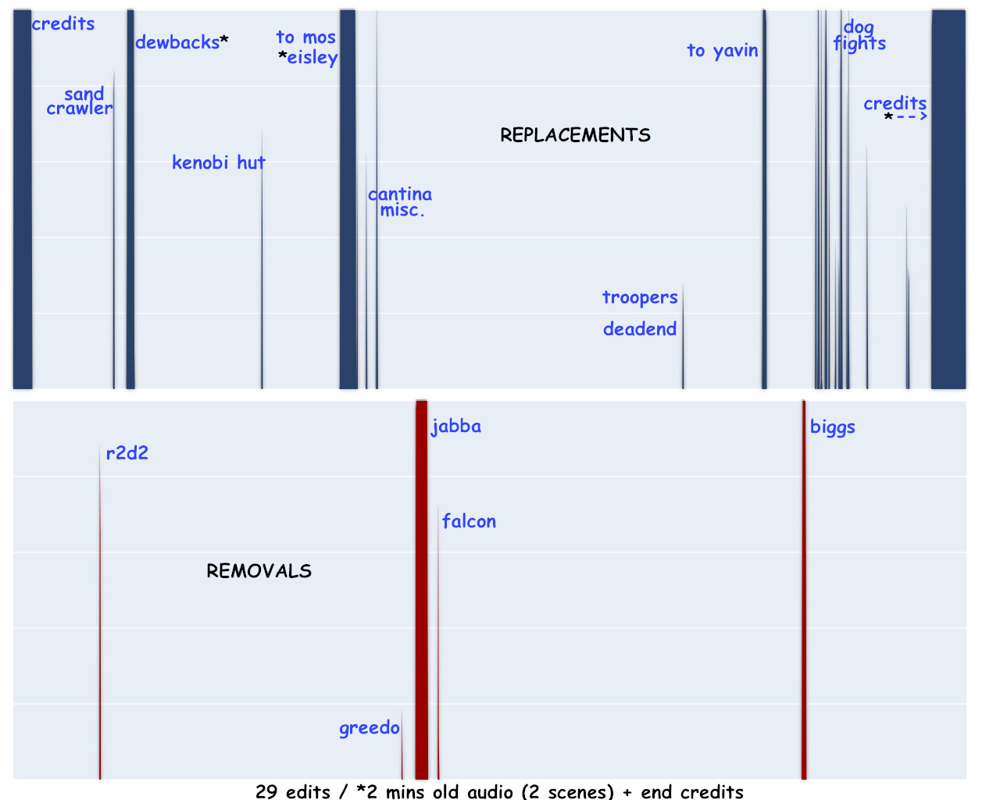

==================================================================================================================

                                          No Blu Hope
                                AKA "No New Hope" Bluray Edition
                            AKA "No New Hope" 2K carat gold edition

 This is the 1080p lossless recut from "official version" bluray back to 1977 version.
 
 This is the bluray version of "No New Hope" https://archive.org/details/reremaster (created from DVDs in 2010)

==================================================================================================================

# No Blu Hope

## Background
The bluray release of the first film was part of a $10M restoration project of the updated 1977 version of the film.

The Lucas teams used multiple "cans" (reels) of film from various sources, un-spliced the negatives and split into various film stock groups, to irreversibly, chemically restore the cells as best they could.
The results are *spectacular*.

In addition, they split out the 2-channel stereo to 6.1 DTS lossless audio, also done extremely well.

## Philosophy for this Project / Repository
_.. then what's my (and most everyone's) problem?_

As is well-known, they added many previously deleted scenes (eg: Biggs and Luke talking before flying off against Death Star) and enhanced some (eg: Jabba the Hutt goes from large human actor to CG "lizard") and more.  Much of the effects are very distracting and anachronistic to the stark beauty of the "small environments" and beautiful practical effects used in 1977.

## Guidelines:
* remove added and heavily edited scenes
* remove edits like Greedo even getting a shot off (spoiler alert: no blasts are seen in 1977 -- Han shoots under the table with _almost_ no warning)
* otherwise keep the restored video, _losslessly_
* keep the cleaned audio, again _losslessly_
* where some more minor edits happened (eg: updated halo/ring around explosions) that dont significantly alter the feel of the film, allow/keep them.

## It's done!  You get a .ts single file out now, that you can remux to .mp4 or .mkv easily if you like.
I am next working on trying to burn out a bluray disc so I can get _glorious_ 24fps 1080p out of my PS3 -- and bluray discs are my only hope...

## See the [run.sh](run.sh) script for the details!
